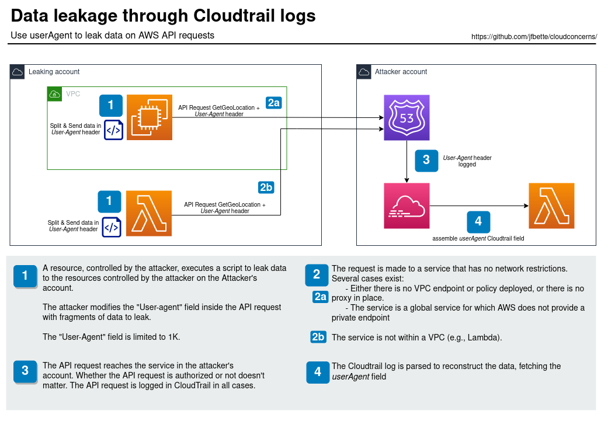

# CloudConcerns: Data Leakage through CloudTrail on Service Request

## Table of Contents
- [Prerequisites](#prerequisites)
- [Modus Operandi](#modus-operandi)
  - [Scenario Diagram](#scenario-diagram)
  - [Scenario Script](#scenario-script)
  - [Discussion on AWS Identities](#a-discussion-on-aws-identities)
- [Scenario Analysis](#scenario-analysis)
  - [Technical Complexity](#technical-complexity)
  - [Data Volume Leaked](#data-volume-leaked)
- [Mitigations](#mitigations)
  - [VPC Endpoint Deployment](#vpc-endpoint-deployment)
  - [Internet Access Filtering](#internet-access-filtering)
- [Exploitation Tooling](#exploitation-tooling)

## Table

| Parameter                | Description                                                          |
|--------------------------|----------------------------------------------------------------------|
| Name of the technique    | Indirect Data Exfiltration through CloudTrail on Service Request     |
| MITRE ATT&CK technique   | [T1537](https://attack.mitre.org/techniques/T1537/)                  |
| Impact type              | Data Leakage                                                         |
| Technical Complexity     | Medium, High                                                         |
| Data Volume Leaked       | Low, medium                                                          |
| Remediation Complexity   | High                                                                 |

![[t1537.png]]
## Prerequisites

- The attacker has control over an attacker account.
- The attacker has control over a compute resource in the leaking account and direct access to the data to leak.

## Modus Operandi

### Scenario Diagram

### Scenario Script

The attacker executes a script on a compute resource (EC2, Lambda, Container) to split the data to be exfiltrated into small chunks.

The objective is to inject these chunks inside the User-Agent HTTP header when making AWS API requests to a resource within the AWS account owned by the attacker.

In the diagram, Route53 with the GetGeoLocation is used as an example. Any operation could be chosen; the specific service is selected because AWS does not provide a VPC endpoint for Route53. The leaking account has no chance to block the request except by filtering outgoing Internet traffic (see [Internet Access Filtering](#internet-access-filtering) section).

Whether the request is authorized or not, it will produce a CloudTrail log. In these logs, the User-Agent HTTP Header will be recorded under the CloudTrail field `userAgent`, containing the exfiltrated data chunk.

On the attacker's account, the set of CloudTrail logs can be parsed using, for example, CloudWatch log events + Lambda to reassemble all userAgent fields and reconstruct the files.

This scenario demonstrates data exfiltration using a side-channel to convey data, utilizing metadata associated with the request rather than the request itself. No log is produce on the leaking account is no Internet proxy is present. The exfiltration can be very sthealthy

### A Discussion on AWS Identities

When making the API request, the attacker will most likely need to provide an identity. 

The identity could be from the leaking account if the resource allows Resource-Based Policies (RBP). The attacker will configure the resource to accept requests from at least the leaking account.

If the destination service doesn't support RBP, the attacker will need to import an identity owned by the attacker's account onto the leaking account. This could be an Access Key/Secret Key, an STS token, etc.

Anonymous access is possible but limited to specific operations on the S3 service.

## Scenario Analysis

### Technical Complexity

The scenario requires preparation steps on the attacker's account with an infrastructure to fetch and reassemble each data chunk.

Although the infrastructure can be serverless, costs will need to be monitored because of the high number of events.

### Data Volume Leaked

The data leakage involves many small chunks of data (max 1K) due to the maximum size of the User-Agent field in CloudTrail logs. If exceeded, the field is truncated.

To reliably transfer the data, some space might be consumed to transform the data (e.g., base64) and ensure chunk ordering.

Aside from size, AWS API requests are subject to rate limitations depending on the service used. 

These constraints limit the throughput of data leakage significantly.

This technique is suited for limited leakage of high-value data.

## Mitigations

Mitigating this vulnerability can be complex and time-consuming. Hence, the remediation for this scenario is evaluated as High.

Several cases exist: 
- Deploy VPC endpoints with appropriate policies for each service to block data leakage. Ensure that the VPC endpoint exists.
- Block access to public service URLs to prevent bypassing VPC endpoints.
- In some cases, this might not be feasible:
  - The VPC endpoint does not exist, or a VPC endpoint policy cannot be applied to that service currently.
  - The AWS service is a global service or a core service like Route53, IAM, etc.

### Internet Access Filtering

This technique can drastically contain the risk or be entirely ineffective, depending on your Internet Proxy capabilities.

If you can unilaterally block public service endpoints from your VPC (e.g., if there's no need for Route53 control plane access), apply least privilege network filtering.

If the VPC needs to establish communication with some AWS services, the situation becomes more challenging. Your Internet Proxy would need to distinguish legitimate service access based on Identity/Destination account. Detecting unusual fields (like base64 encoded or cryptic fields in the User-Agent) can help identify potential data exfiltration attempts.

The case is worse if all your resources are not in VPC (e.g. Lambda are not in VPC by default) and rather in AWS networks. Not control at all could be deployed to achieve the data exfiltration!

## Exploitation Tooling

**Coming soon!**
